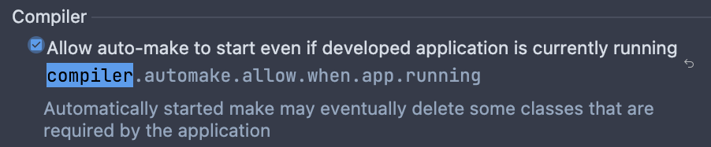
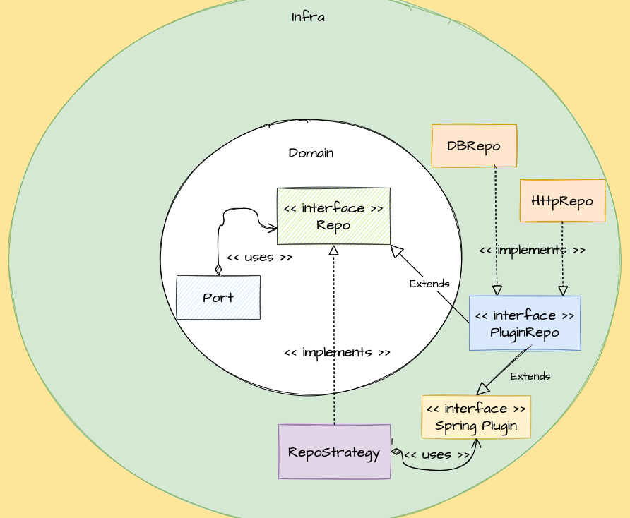

How to enable devtools in IntelliJ:
1. Add the following configuration onto the pom file:
```properties
<dependency>
    <groupId>org.springframework.boot</groupId>
    <artifactId>spring-boot-devtools</artifactId>
    <scope>runtime</scope>
    <optional>true</optional>
</dependency>
```
2. Under the section compiler, check the option:
   
3. Finally, under advanced settings/compiler section, check the box:
   

## Facilitating Strategy pattern using Spring Plugin library
This is an example of Spring Plugin library applied to an Hexagonal Architecture use case where we're required to 
introduce another repo implementation that runs in tandem with the existing one.

One of the requirements is to vary the order of execution between implementations, e.g. first db, then http, etc.



One improvement would be to play with the `Plugin#supports` method so that some repo implementations can be dynamically 
changed based out of a configuration property, although it would required the `RepoStrategy#plugins` to be refreshed upon
configuration updates.
[This video](https://www.youtube.com/watch?time_continue=367&v=GlV5sXdXPu4&feature=emb_logo&themeRefresh=1) helped me discover this great library. 
